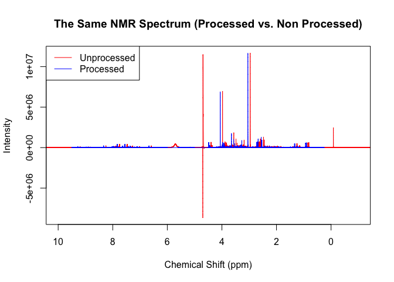
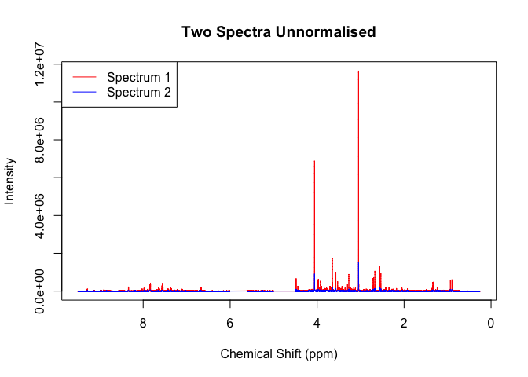
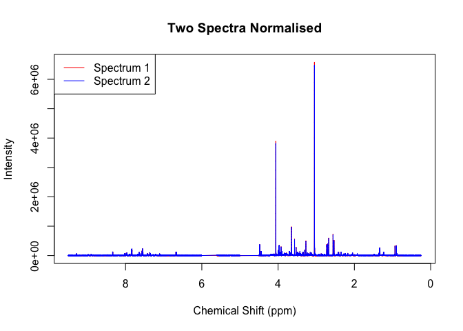
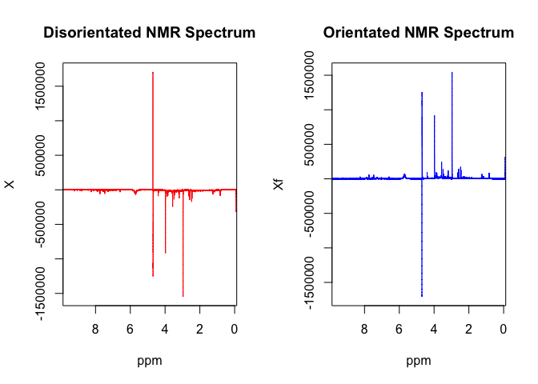

<!-- README.md is generated from README.Rmd. Please edit that file -->

# concentr8r

<!-- badges: start -->
<!-- badges: end -->

concentr8r is a collection of normalisation functions that are intended
for magnetic resonance spectroscopy (MRS) spectra, more specifically
that from nuclear magnetic resonance (NMR) and mass spectrometry (MS).
Normalisation is a crucial yet context-depended aspect of analysing MRS
data meaning that one method may work perfectly with one study but make
the spectra in another study worse so having a diverse range of
techniques available is useful.

## Installation

<!-- You can install the released version of concentr8r from [CRAN](https://CRAN.R-project.org) with: -->
<!-- ``` r-->
<!-- install.packages("concentr8r")-->
<!-- ```-->

concentr8r is currently only available on [GitHub](https://github.com/)
and can be sourced using the code below:

``` r
# install.packages("devtools")
devtools::install_github("kylebario/concentr8r")
```

## Standard Pipeline

The intended use of concentr8r is to manipulate your NMR spectra so that
they are as comparable as possible. This includes properly preprocessing
the spectra, removing regions that are non-quantative, as well as
correcting/flattening the baseline. It also includes normalising your
spectra and removing the effects of dilution so that their
concentrations are comparable.  
Below is the code for the standard pipeline used to preprocess NMR
spectra:

``` r
library(concentr8r)
read_in(path=system.file('extdata',package='concentr8r'),exp_type=list(exp=c("PROF_URINE_NOESY")), n_spec = 'multiple')
plot(ppm, X[2,], type = 'l', col = 'red', main = 'The Same NMR Spectrum (Processed vs. Non Processed)', xlab = 'Chemical Shift (ppm)', ylab = 'Intensity', xlim = c(10,-1))
preproc(X, ppm, meta, flip = TRUE, cali = TRUE, calib = 'tsp')
#> Flipping the spectra... Done.
#> Calibrating to tsp... Done.
#> Checking line width of spectra... All spectra have linewidths under 1 
#> Removing non-quantative regions... Done.
#> Performing baseline correction... Done.
#> Calculating Noise Estimations... Done.
#> Checking that X and meta rows match... Done.
#> Checking that ppm length and X columns match... Done.
#> 
points(ppm, X[2,], type = 'l', col = 'blue')
legend('topleft', legend = c("Unprocessed", "Processed"), col = c('red', 'blue'), lty = 1)
```



``` r
plot(ppm, X[2,], type = 'l', col = 'red', main = 'Two Spectra Unnormalised', xlab = 'Chemical Shift (ppm)', ylab = 'Intensity', xlim = c(9.5,0.25))
points(ppm, X[1,], type = 'l', col = 'blue')
legend('topleft', legend = c("Spectrum 1", "Spectrum 2"), col = c('red', 'blue'), lty = 1)
```



``` r
pqNorm(X, noi)
#> Preparing Spectra and Reference...
#> Selecting ppm and Removing Noise... Done.
#> Binning... Done.
#> Calculating Reference Spectrum... Done.
#> Calculating Dilfs... Using the Mode... Done.
#> Normalising X... Done.
#> 
plot(ppm, X_pqn[2,], type = 'l', col = 'red', main = 'Two Spectra Normalised', xlab = 'Chemical Shift (ppm)', ylab = 'Intensity', xlim = c(9.5,0.25))
points(ppm, X_pqn[1,], type = 'l', col = 'blue')
legend('topleft', legend = c("Spectrum 1", "Spectrum 2"), col = c('red', 'blue'), lty = 1)
```



As you can see there are multiple stages in preprocessing, that build to
producing highly comparable spectra which is made all the easier by
concentr8r.

## Data Manipulation Functions

Data Manipulation ranges from ensuring the spectra are correctly
orientated to scaling spectra based on their relationship to a
reference. Here are some of the functions within concentr8r designed to
do just that.

### Flip


